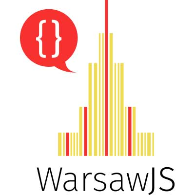

# slides-lightning-talks

> :clipboard: Slides for whole year of WarsawJS lightning talks.

## Plan for topics of speeches

### 1) Intersection Observer

* https://piecioshka.github.io/slides-lightning-talks/1/
* https://piecioshka.github.io/slides-lightning-talks/1/demo.html

### 2) Is My JSON Valid

* https://piecioshka.github.io/slides-lightning-talks/2/
* https://piecioshka.github.io/slides-lightning-talks/2/demo.html

### 3) Wskazówki dla prelegentów jak robić prelekcje na meetupy

### 4) TBA

## Organization logo

## Event in social media

* WarsawJS Meetup #38
    - https://www.facebook.com/events/140250189924922/
    - https://www.meetup.com/WarsawJS/events/243756529/

## Slides engine: [remarkjs](http://remarkjs.com)

* Download latest version: https://remarkjs.com/downloads/remark-latest.min.js

## License

[The MIT License](http://piecioshka.mit-license.org) @ 2017
