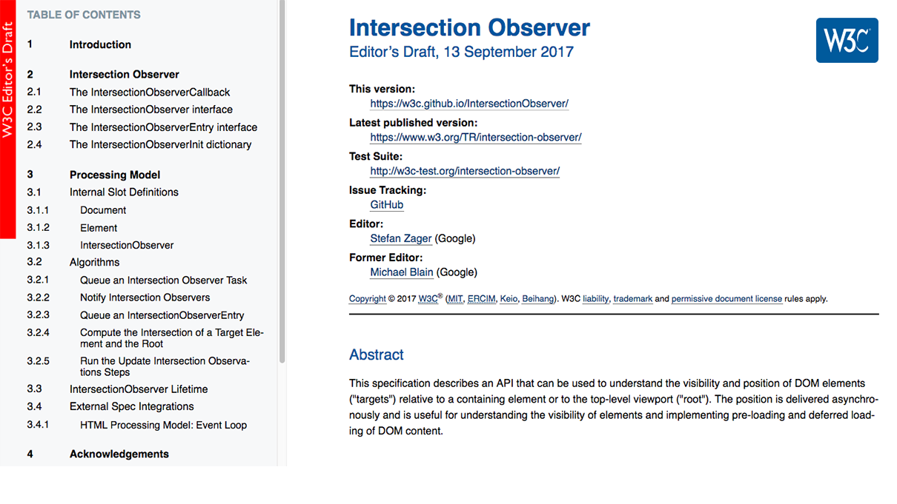

class: middle, slide-invert-colors
background-image: url(../../images/warsawjs/logo-right-1920x1200.jpg)

.size60[
# WarsawJS Meetup #38 Lightning Talks
]

---

class: middle

# Intersection Observer

---

class: middle

# Spec

## [w3c.github.io/IntersectionObserver][spec]

---

class: middle

# Polyfill

## [github.com/w3c/IntersectionObserver][project]
## ↳ [polyfill][project-polyfill]

---

class: slide-fullscreen-content

---

class: middle

# Kodujemy!

---

class: middle

# Thanks!

## See you on next WarsawJS!

[spec]: https://w3c.github.io/IntersectionObserver/
[project]: https://github.com/w3c/IntersectionObserver/
[project-polyfill]: https://github.com/w3c/IntersectionObserver/tree/gh-pages/polyfill
