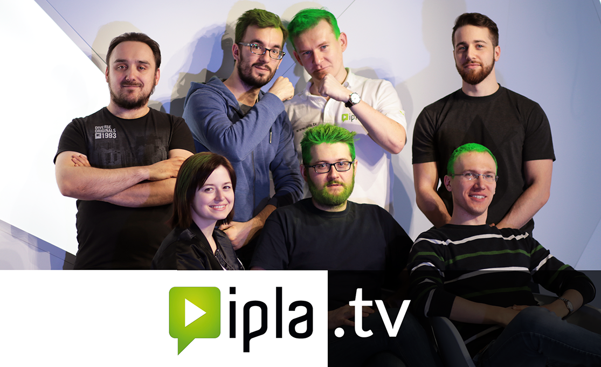
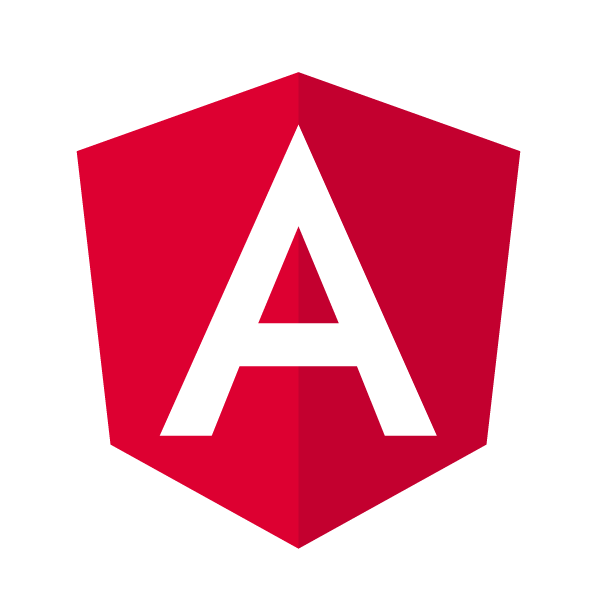

class: middle, slide-invert-colors
background-image: url(../../images/warsawjs/logo-right-1920x1200.jpg)

.size60[
# WarsawJS Meetup #43<br/><span class="slim">Lightning Talks</span>
]

---

class: bottom, center, slide-invert-colors, slide-fullscreen-content, slide-fullscreen-blockquote



---

class: middle, slide-invert-colors, slide-fullscreen-content
background-image: linear-gradient(rgba(0, 0, 0, 0.6), rgba(0, 0, 0, 0.3)), url(./images/ipla-web-team.png)

.phrase-1[
Biggest project<br/><mark>in my life</mark>
]

.phrase-2[
<pre>
 SPA                 SSR
RWD                PWA
 BEM               POC
 SCSS
</pre>
]

.phrase-3[
```
flatten
groupby
invert
uniq
```
]

.phrase-4[
How long?<br/>`11 month` ⏰
]


.phrase-5[
LOC = `63k`
]

.phrase-6[
Deps size 📦 `504 MB`
]

.logo-angular[

]

.logo-typescript[

]

.logo-express[

]

.logo-rxjs[

]
.logo-lodash[

]

???

1. definicja dużego projektu pod kątem technologicznym?

    - czas trwania
    - linie kodu
    - ilość zależności
    - SSR, PWA, RWD, SCSS
    + Wykonanie POCa pomogło w celu wybrania technologii
    - BEM nie był konieczny przy pracy z komponentami
        - TYLKO konwencji tworzenia klas

2. mieliśmy takie trudności

    - pewnie wszyscy znacie:
        - brak backendu
        - brak grafik
        - brak ux
    - dużo odpowiedzialności na barkach front-endu
    - część zespołu musiała robić jeszcze bieżące utrzymanie
    - termin releasu & zakres projektu

3. jak sobie poradziłem

    - motywowałem zespół
    - pomagałem w developmencie ale też wziąłem odpowiedzialność wymyślania całej architektury
    - robiłem code review
    - w dniu release: pomalowaliśmy włosy na zielono aby nie oszaleć
    + W PRAKTYCE: Idea komponentów: komunikacja między komponentami relacji:
        - brat-siostra,
        - rodzic-dziecko
        - odwrotnie

4. chcecie zobaczyć jak mi poszło? zobacz na www.ipla.tv

---

class: middle, slide-invert-colors
background-image: url(../../images/warsawjs/logo-right-1920x1200.jpg)

.size60[
# Dziękuję ❤️
]
